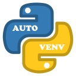

<!-- https://www.iconfinder.com/icons/4518857/python_icon -->
<center></center>

# auto_venv: All-in-one Automatic Virtual-Environment Creation + Requirements Installation using pip.

# Empower your script with **auto_venv**: Say Goodbye to Manual Setup or Install!

With **auto_venv**, effortlessly automate virtual environment creation and pip-installs for your script's requirements.  No more tedious manual setups, no more hassle with requirement installations, and certainly, no extra steps for executing your script.  No need to install simple scripts, just copy your python files and run.

**auto_venv** sets up a virtual environment in a temporary location upon your script's first run, seamlessly installing all specified requirements via pip.

# Usage

Use a recent Python 3 (3.6+) version:

```python
#!/bin/env python3
```

Download and bundle a copy of **[auto_venv.py](https://github.com/amal-khailtash/auto_venv/raw/main/auto_venv.py)** with your main script.  Import **auto_venv** and call its init function passing:

1. filename (str)            : calling script's filename including full path.
2. requires (list[str])      : list of requirements to install
3. fancy    (bool, optional) : fancy/ANSI printout.  (Defaults to False)
4. quiet    (bool, optional) : quiet (no) messages.  (Defaults to False)
5. dot_pth  (bool, optional) : create .pth link to the .venv  (Defaults to False)

```python
from pathlib import Path

import auto_venv

__filename__ = str(Path(__file__).resolve())
__requires__ = [
    "beautifulsoup4==4.12.3",
    "requests==2.31.0",
    "pyyaml==6.0.1",
]

auto_venv.init(__filename__, __requires__, True, False, True)
```

Import required packages, and continue with the rest of your script.

```python
import bs4       # noqa: E402
import requests  # noqa: E402
import yaml      # noqa: E402

print(f"bs4 version      : {bs4.__version__}")
print(f"requests version : {requests.__version__}")
print(f"yaml version     : {yaml.__version__}\n")

soup = bs4.BeautifulSoup(requests.get("https://pypi.org").content, "html.parser")
print(yaml.dump({"header": soup.find("h1").get_text()}))
```

> :memo: **Note:** that because not all our imports are at the top of the script, we need to add **# noqa: E402** to the end of each import to ignore Lint error: <u>**Module level import not at top of the file**</u>.

## Virtual Environment

By default virtual environments are created under /tmp, which is NOT persistent and will be removed upon machine reboot.  You can change the default location by setting **VENV_AUTO_ROOT** environment variable.

To avoid collision with other users, scripts, ... the name of the virtual environment is: **.venv_\<UUID>_\<USER>_\<FILENAME>**

    UUID        unique id generated based on the full script path (filename) passed to init
    USER        is the username
    FILENAME    is the basename of the script without full path

## VSCode and Intellisense

To be able to debug/navigate the installed packages, **auto_venv** will create a **.pth** file under /home/${USER}/.local/lib/python<VERSION>/site-packages/ with name **venv_\<UUID>_\<USER>_\<FILENAME>.pth** that points to the created virtual environment.  This will add the path to the virtual environment to the PYTHON_PATH.  This way, VSCode and other IDEs would be able to find the packages installed in this virtual enviroment.  If multiple dependencies with different versions are installed in different virtual envirnment, which version will be picked up is not very clear.  For this reason, only enable this option (**dot_pth** or **AUTO_VENV_DOT_PTH**) when debugging using IDE.

## Environment variables

**auto_venv** uses the following environment variables to override the fancy/quiet arguments.

    VENV_AUTO_ROOT       path to location for creating the virtual environment, default is /tmp

    AUTO_VENV_FANCY      fancy is set to True if set to '1', 'y', 'yes' or 'true', otherwise False
    AUTO_VENV_QUIET      quiet is set to True if set to '1', 'y', 'yes' or 'true', otherwise False
    AUTO_VENV_DOT_PTH    dot_pth is set to True if set to '1', 'y', 'yes' or 'true', otherwise False

## Example output

First run (fancy=True, quiet=False)

```bash
$ example.py
╭────────────────────────────────────────────────────────────────────────────────
│ ➜ First run or some requirements were not found.  Reinstalling ...
│ ➜ Creating virtual environment ...
│     '/tmp/.venv_da65983c-2c58-5629-94e6-e157b6565a0d_${USER}_example.py'
│ ➜ Setting up PYTHONPATH ...
│     '/home/${USER}/.local/lib/python3.12/site-packages/venv_da65983c-2c58-5629-94e6-e157b6565a0d_${USER}_example.py.pth'
│ ➜ Upgrading 'pip' ...
│ ➜ Installing requirements:
│   ✓ beautifulsoup4==4.12.3
│   ✓ requests==2.31.0
│   ✓ pyyaml==6.0.1
│ ➜ Continuing with the script ...
╰────────────────────────────────────────────────────────────────────────────────
bs4 version      : 4.12.3
requests version : 2.31.0
yaml version     : 6.0.1

header: Find, install and publish Python packages with the Python Package Index
```

Runs after ():

```bash
$ example.py
╭────────────────────────────────────────────────────────────────────────────────
│ ➜ Virtual environment already exists ...
│     '/tmp/.venv_da65983c-2c58-5629-94e6-e157b6565a0d_${USER}_example.py'
│ ➜ All requirements are met.
│ ➜ Continuing with the script ...
╰────────────────────────────────────────────────────────────────────────────────
bs4 version      : 4.12.3
requests version : 2.31.0
yaml version     : 6.0.1

header: Find, install and publish Python packages with the Python Package Index
```

# Notes

Once the requirements are installed, if you update the requirement versions, there is no automatic way to check if the versions have changed.  You just need to delete the virtual environment (and .pth file) and rerun the script with the new requirements.

# References
* Inspied by [pip.wtf](https://pip.wtf/)
* [PEP 582 - Python local packages directory](https://peps.python.org/pep-0582/)
* [pip - Installing Python Modules](https://docs.python.org/3/installing/index.html)
* [venv - Creation of virtual environments](https://docs.python.org/3/library/venv.html)
